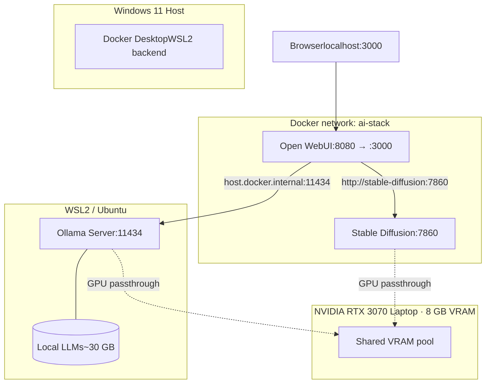

# Local AI Stack — Self-Hosted Multi-Model Lab on Consumer Hardware

A reproducible, single-command deployment of a private AI workstation running seven LLMs, an embedding model, and Stable Diffusion image generation — entirely offline, on a laptop with **8 GB of VRAM**.

> Built as a working environment for daily development, not a tutorial. Every constraint, tradeoff, and failure mode is documented because that's what makes this useful instead of pretty.

---

## What This Is

A Dockerized AI stack that runs three coordinated services on a single Windows host via WSL2:

- **Ollama** — local LLM serving (Qwen 3, Gemma 4, Llama 3.2 Vision, DeepSeek-R1, embedding models)
- **Open WebUI** — chat interface, RAG document Q&A, model management, prompt engineering workspace
- **Stable Diffusion (SD.Next)** — image generation API integrated into Open WebUI for inline image generation from chat

All services share a single GPU through NVIDIA Container Toolkit, talk to each other on a private Docker network, and are managed through one `docker-compose.yml`.

## Architecture



## Hardware Target

| Component | Spec | Notes |
|---|---|---|
| GPU | RTX 3070 Laptop (8 GB VRAM) | Tightest constraint — every choice flows from this |
| OS | Windows 11 + WSL2 (Ubuntu 24.04) | Verified on build 22631+ |
| Docker | Docker Desktop with WSL2 backend | NVIDIA Container Toolkit installed inside WSL |
| Disk | ~50 GB free | Models + checkpoints + container images |

The stack scales up cleanly to better hardware (and one of the design goals was making the upgrade path painless — the `docker-compose.yml` is the same on a 24 GB 4090).

## Quick Start

```bash
# 1. One-time host setup (NVIDIA Container Toolkit + Ollama)
./scripts/setup-environment.sh

# 2. Pull the recommended model set (sized for 8 GB VRAM)
./scripts/pull-models.sh

# 3. Bring up the stack
docker compose up -d

# 4. Verify everything is healthy
./scripts/healthcheck.sh
```

Then open `http://localhost:3000` and create your admin account. See [SETUP_GUIDE.md](./SETUP_GUIDE.md) for the full walkthrough.

## What's Inside

```
local-ai-stack/
├── README.md                          ← you are here
├── SETUP_GUIDE.md                     ← full step-by-step walkthrough
├── docker-compose.yml                 ← single source of truth for the stack
├── .gitignore
├── docs/
│   ├── 01-prerequisites.md            hardware, drivers, Windows version
│   ├── 02-wsl-docker-nvidia.md        WSL2 + Docker + NVIDIA Container Toolkit
│   ├── 03-ollama-models.md            model selection rationale for 8 GB
│   ├── 04-openwebui-stable-diffusion.md  wiring the two containers together
│   ├── 05-custom-models-loras.md      adding SD checkpoints + LoRAs
│   ├── 06-vram-management.md          the 8 GB game — what fits with what
│   ├── 07-troubleshooting.md          every failure mode I hit, with fixes
│   └── 08-architecture.md             design decisions and tradeoffs
├── scripts/
│   ├── setup-environment.sh           NVIDIA Container Toolkit + Ollama + deps
│   ├── pull-models.sh                 idempotent model pulls
│   ├── install-checkpoint.sh          install SD checkpoints/LoRAs with correct paths
│   ├── manage-vram.sh                 stop/start Ollama models to free VRAM for SD
│   └── healthcheck.sh                 verify GPU passthrough + service health
├── prompts/
│   ├── system-prompts.md              Open WebUI model system prompts
│   └── stable-diffusion-prompts.md    tested prompts (line art, photoreal, etc.)
└── .github/workflows/pages.yml        GitHub Pages deployment via Jekyll
```

## Why This Project Exists (Portfolio Context)

Three things this demonstrates that most "I ran an LLM locally" repos don't:

1. **Multi-container orchestration with hardware constraints.** GPU passthrough through WSL2 to multiple containers sharing one 8 GB VRAM pool is non-trivial. The `docker-compose.yml` in this repo is the artifact of solving that problem — networks, volumes, runtime config, and the specific CLI flags that prevent OOM crashes when both containers are warm.

2. **Honest engineering documentation.** The [troubleshooting doc](./docs/07-troubleshooting.md) catalogs every failure I hit: the `SD_WEBUI_VARIANT: unbound variable` crash, the case-sensitive `Stable-diffusion` vs `stable-diffusion` folder bug, the `host.docker.internal` DNS failure that required moving to a custom Docker network. These are the things that eat days of real work.

3. **Operational thinking, not just install steps.** [VRAM management](./docs/06-vram-management.md) covers what models can be loaded simultaneously, when to call `ollama stop` to free memory before image generation, and which quantizations preserve coherence at the 8 GB ceiling. This is the kind of resource accounting that matters in production inference.

## Limitations (Honest)

- **8 GB is the tightest constraint.** A 14B model and Stable Diffusion cannot be hot in VRAM at the same time. The `manage-vram.sh` script encodes the workaround, but a dual-GPU or 16+ GB setup would eliminate it.
- **Aggressive quantization tradeoff.** Most LLMs in `pull-models.sh` are Q4_K_M. They're coherent and fast, but a Q8 or FP16 deployment on better hardware would noticeably improve nuanced reasoning.
- **Windows-host specific.** WSL2 + Docker Desktop is the assumed substrate. Native Linux works with minor changes; macOS is out of scope (no NVIDIA).
- **No production hardening.** No TLS, no auth proxy, no observability stack. This is a single-user dev environment, and the docs are explicit about that.

## License

MIT. See [LICENSE](./LICENSE).